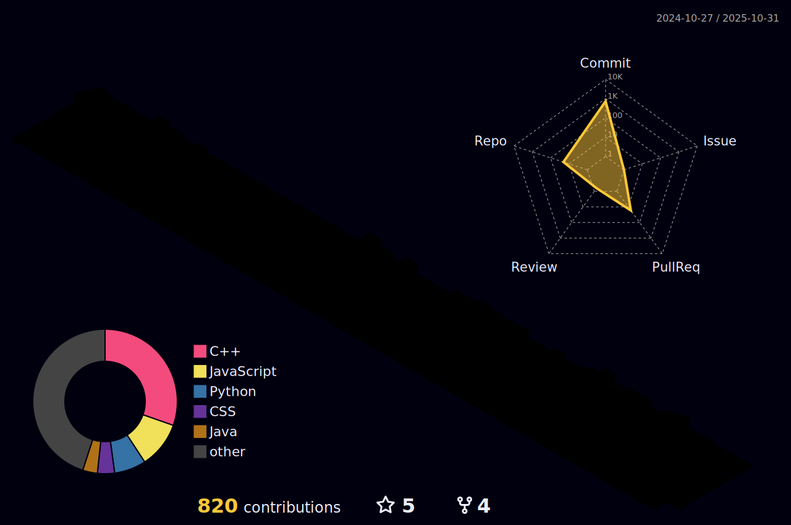

## 👋 About Me
- Hi, I'm Neel Pandey @N-PCs
- I'm interested in Computer Science and Electronics
- I'm currently learning Computer Science Engineering
- I'm looking to collaborate in real time collaborative project
- 📫 How to reach me: neelpandeyofficial@gmail.com
- 🧑‍💻 LinkedIn: www.linkedin.com/in/neel-pandey-4b7469324
- 😄 Pronouns: He/Him
- ⚡ Fun fact: Always Curious! :)

 

## 🏆 GitHub Trophies

## 🌐 Connect with Me

## 🛠️ Languages and Tools

## 📊 GitHub Stats

  

    
  

 

## 📈 Activity Graph

  

## 💻 Tech Stack
          

## 🏆 Coding Platform Stats

  

    

      <h3 align="center">📊 LeetCode Stats</h3>
      
    

    

      <h3 align="center">⚡ Codeforces Stats</h3>
      
    

  

  

  

<picture>
  <source media="(prefers-color-scheme: dark)" srcset="https://raw.githubusercontent.com/N-PCs/N-PCs/output/github-snake-dark.svg" />
  <source media="(prefers-color-scheme: light)" srcset="https://raw.githubusercontent.com/N-PCs/N-PCs/output/github-snake.svg" />
  
</picture>

## 👋 Footer

